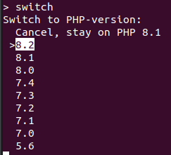

# 🔄 PHP Switch Scripts

This is my tweaked version of https://github.com/rapidwebltd/php-switch-scripts which I use almost daily since 2019.

With this script switching between PHP-versions in Ubuntu is easy!

More info about requirements, checks and usage in the [original documentation](https://github.com/rapidwebltd/php-switch-scripts/blob/a477928c0fb37a0be7d12892a13aa708c55b0342/README.md)

## Installation
Run `setup.sh` once.

This may take some time depending on your system and connection speed.

It will require you to enter your password to install new packages.

I added an alias to my /home/{user}/.bash_aliases so I can just run `switch` from my CLI:

`alias switch='sudo /home/switch-php.sh'`

## Usage
Run `switch-php.sh`, you can choose to which version you want to switch:

## Sources
- https://github.com/rapidwebltd/php-switch-scripts
- https://askubuntu.com/a/1386907
