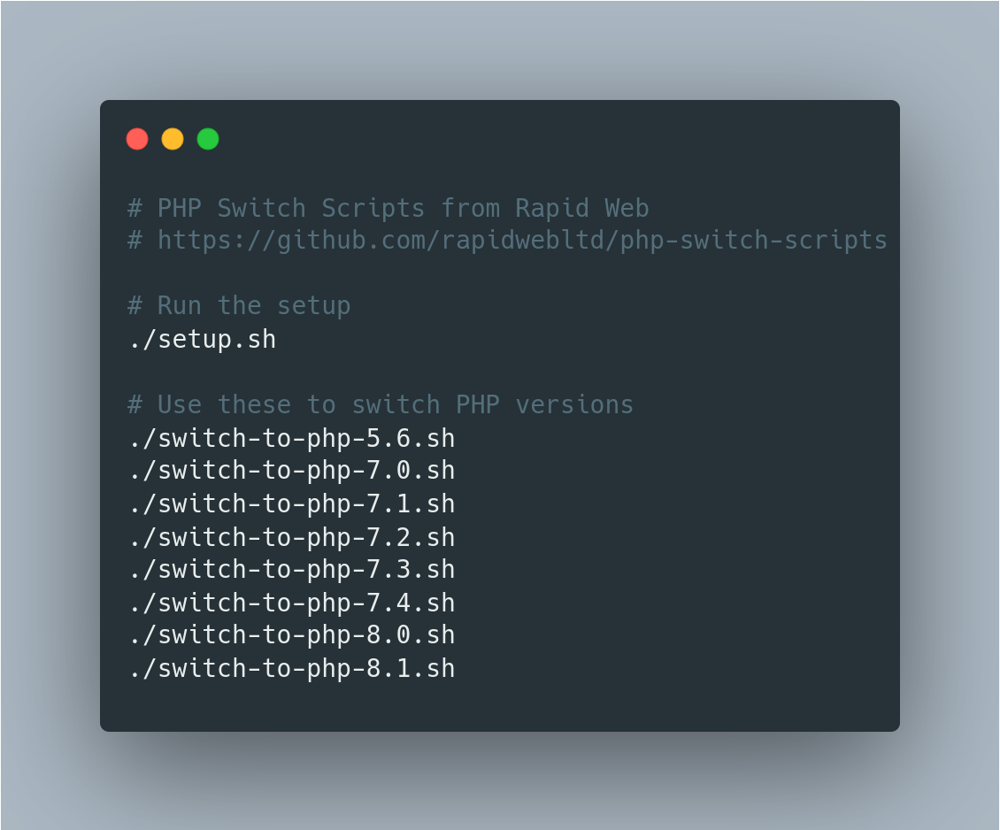

# 🔄 PHP Switch Scripts

These scripts are designed to aid in the setup of and switching between multiple PHP versions in Ubuntu 14.04 LTS or newer.




Please note that these scripts install packages from a third-party repository, provided by [Ondřej Surý](https://twitter.com/oerdnj). More details are available at the repository's [website](https://deb.sury.org/), [PPA page on Launchpad](https://launchpad.net/~ondrej/+archive/ubuntu/php/) and [Twitter account](https://twitter.com/debsuryorg).

## Requirements

* Ubuntu 14.04.* LTS or newer
* Apache 2.4.*

You can check you have the required versions by running the following command.

```
lsb_release -a | grep Ubuntu && apache2 -v | grep Apache
```

You should see something similar to the below.

```
Description:    Ubuntu 14.04.5 LTS
Server version: Apache/2.4.18 (Ubuntu)
```

## Setup

First, clone the repository, and change directory if you have not already done so.

```
git clone https://github.com/rapidwebltd/php-switch-scripts.git
cd php-switch-scripts
```

Next, to setup all the supported PHP versions and common PHP extensions for them, you just need to run the `setup.sh` script. This is shown below.

```
./setup.sh
```

This may take some time depending on your system and connection speed. It will also require you to enter your password to install new packages.

When you see a message similar to the following, setup is complete and you are ready to switch between PHP versions at will.

```
* Setup complete. You may now use the 'switch-to-php-*.*.sh' scripts.`
```

## Usage

Once setup is complete, you can easily switch between different PHP versions using the appropriately named scripts. Examples are shown below.

```
./switch-to-php-5.6.sh
./switch-to-php-7.0.sh
./switch-to-php-7.1.sh
./switch-to-php-7.2.sh
./switch-to-php-7.3.sh
./switch-to-php-7.4.sh
./switch-to-php-8.0.sh
./switch-to-php-8.1.sh
./switch-to-php-8.2.sh
```

This will alter the versions of PHP running in Apache and the command line. Your password will be required to enable/disable Apache modules, restart the web server and alter the default PHP CLI version.

## Verification

If you wish, you can check that the switch was completed successfully.

You can verify the command line version of PHP has changed with the following command.

```
php -v | grep PHP
```

You can check the version of PHP running in Apache by creating a new PHP file, that calls the `phpinfo()` method, then accessing it via a web browser. An example is shown below.

```php
<?php phpinfo(); ?>
```

